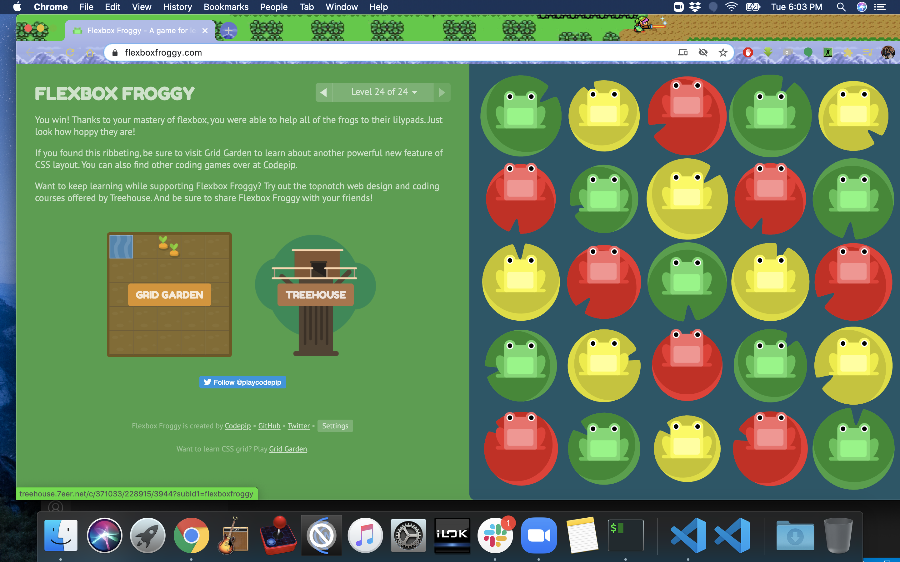

# Read: 03 - Flexbox and Templating

## Javascript Templating Language and Engine— Mustache.js with Node and Express

### Javascript Templating

- Javascript templating is a fast and efficient technique to render client-side view templates with Javascript by using a JSON data source.
- The template is HTML markup, with added templating tags that will either insert variables or run programming logic.
- The template engine then replaces variables and instances declared in a template file with actual values at runtime, and convert the template into an HTML file sent to the client.

### Mustache

- Mustache is a logic-less template syntax. It can be used for HTML, config files, source code — anything. It works by expanding tags in a template using values provided in a hash or object.
- It is often referred to as “logic-less” because there are no if statements, else clauses, or for loops. Instead, there are only tags
- mustache.js is an implementation of the mustache template system in JavaScript. It is often considered the base for JavaScript templating. And, since mustache supports various languages, we don’t need a separate templating system on the server side.
```
Mustache.render(“Hello, {{name}}”, { name: “Sherlynn” });
// returns: Hello, Sherlynn
```
- In the above, we see two braces around {{ name }}. This is Mustache syntax to show that it is a placeholder. When Mustache compiles this, it will look for the ‘name’ property in the object we pass in, and replace {{ name }} with the actual value, e,g, “Sherlynn”.
- Mustache is NOT a templating engine

## A Complete Guide to Flexbox

- link to page - https://css-tricks.com/snippets/css/a-guide-to-flexbox/
- covered in preveous notes

#### a brief overview
- The flex container becomes flexible by setting the display property to flex:
```
.container {
  display: flex; /* or inline-flex */
}
```
- The flex container properties are:
  1. flex-direction
  1. flex-wrap
  1. flex-flow
  1. justify-content
  1. align-items
  1. align-content
- The direct child elements of a flex container automatically becomes flexible (flex) items.
- The flex item properties are:
  1. order
  1. flex-grow
  1. flex-shrink
  1. flex-basis
  1. flex
  1. align-self

## flex-box froggy
- completed all 24 levels


[Back to code 301 notes](../301.md)

## Reference: Mustache.js Official documentation

- https://github.com/janl/mustache.js