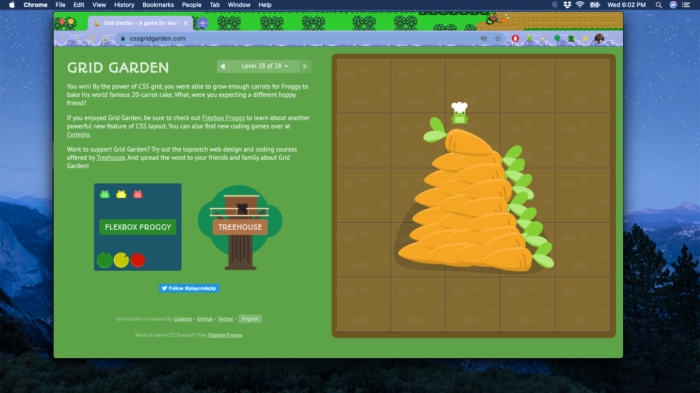

- link to .sort information - https://repl.it/repls/NotedPunyInformation

# Read: 04 - Responsive Web Design and Regular Expressions

## CSS Grid Garden
- completed


## RegExr
- cheat sheet - https://regexr.com/

## Regex Tutorial

### A quick cheatsheet by examples

- Anchors — ^ and $
```
^The        matches any string that starts with The -> Try it!
end$        matches a string that ends with end
^The end$   exact string match (starts and ends with The end)
roar        matches any string that has the text roar in it
```
- Quantifiers — * + ? and {}
```
abc*        matches a string that has ab followed by zero or more c -> Try it!
abc+        matches a string that has ab followed by one or more c
abc?        matches a string that has ab followed by zero or one c
abc{2}      matches a string that has ab followed by 2 c
abc{2,}     matches a string that has ab followed by 2 or more c
abc{2,5}    matches a string that has ab followed by 2 up to 5 c
a(bc)*      matches a string that has a followed by zero or more copies of the sequence bc
a(bc){2,5}  matches a string that has a followed by 2 up to 5 copies of the sequence bc
```
- OR operator — | or []
```
a(b|c)     matches a string that has a followed by b or c (and captures b or c) -> Try it!
a[bc]      same as previous, but without capturing b or c
```
- Character classes — \d \w \s and .
```
\d         matches a single character that is a digit -> Try it!
\w         matches a word character (alphanumeric character plus underscore) -> Try it!
\s         matches a whitespace character (includes tabs and line breaks)
```
- Use the . operator carefully since often class or negated character class (which we’ll cover next) are faster and more precise.
- \d, \w and \s also present their negations with \D, \W and \S respectively.
- For example, \D will perform the inverse match with respect to that obtained with \d.
```
\D         matches a single non-digit character
```
- In order to be taken literally, you must escape the characters ^.[$()|*+?{\with a backslash \ as they have special meaning.
```
\$\d       matches a string that has a $ before one digit
```
- Notice that you can match also non-printable characters like tabs \t, new-lines \n, carriage returns \r.
- Flags
```
g (global) does not return after the first match, restarting the subsequent searches from the end of the previous match
m (multi-line) when enabled ^ and $ will match the start and end of a line, instead of the whole string
i (insensitive) makes the whole expression case-insensitive (for instance /aBc/i would match AbC)
```
- Intermediate topics
```
a(bc)           parentheses create a capturing group with value bc -> Try it!
a(?:bc)*        using ?: we disable the capturing group -> Try it!
a(?<foo>bc)     using ?<foo> we put a name to the group -> Try it!
```
- Bracket expressions — []
```
[abc]            matches a string that has either an a or a b or a c -> is the same as a|b|c -> Try it!
[a-c]            same as previous
[a-fA-F0-9]      a string that represents a single hexadecimal digit, case insensitively -> Try it!
[0-9]%           a string that has a character from 0 to 9 before a % sign
[^a-zA-Z]        a string that has not a letter from a to z or from A to Z. In this case the ^ is used as negation of the expression -> Try it!
```
- Back-references — \1
```
([abc])\1              using \1 it matches the same text that was matched by the first capturing group -> Try it!
([abc])([de])\2\1      we can use \2 (\3, \4, etc.) to identify the same text that was matched by the second (third, fourth, etc.) capturing group -> Try it!
(?<foo>[abc])\k<foo>   we put the name foo to the group and we reference it later (\k<foo>). The result is the same of the first regex -> Try it!
```
- Look-ahead and Look-behind — (?=) and (?<=)
```
d(?=r)       matches a d only if is followed by r, but r will not be part of the overall regex match -> Try it!
(?<=r)d      matches a d only if is preceded by an r, but r will not be part of the overall regex match -> Try it!
```
- You can use also the negation operator!
```
d(?!r)       matches a d only if is not followed by r, but r will not be part of the overall regex match -> Try it!
(?<!r)d      matches a d only if is not preceded by an r, but r will not be part of the overall regex match -> Try it!
```

## Regex 101
- https://regex101.com/
## CSS Grid reference
- https://css-tricks.com/snippets/css/complete-guide-grid/

## grid gardenCommon Responsive Layouts with CSS Grid
- link to article - https://medium.com/samsung-internet-dev/common-responsive-layouts-with-css-grid-and-some-without-245a862f48df

[Back to code 301 notes](../301.md)